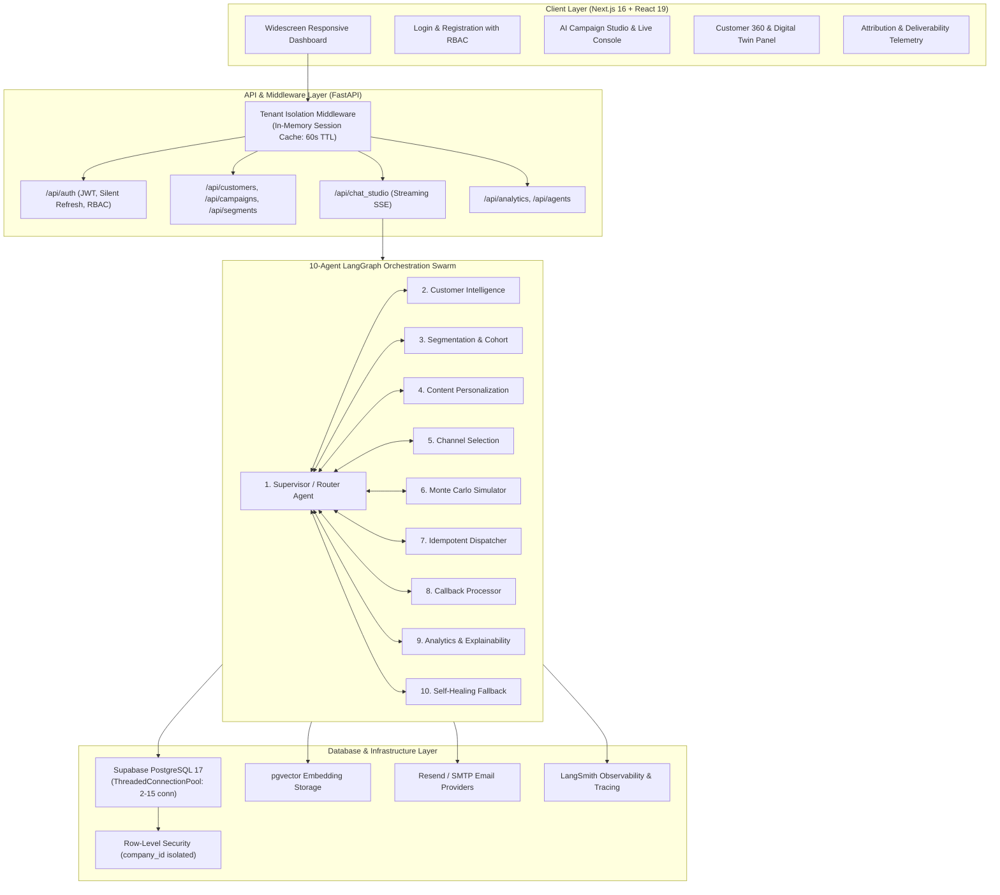
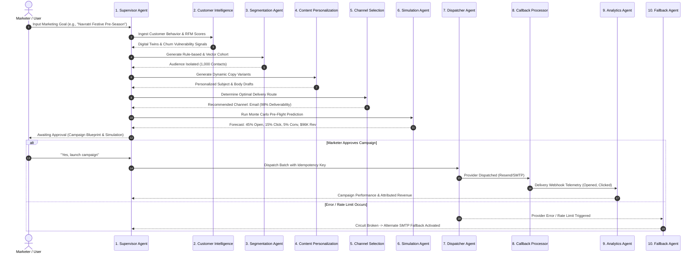

# Catalyst V2 — AI-Native Multi-Tenant CRM Platform

<div align="center">


**Autonomous Customer Intelligence, 10-Agent LangGraph Swarms, and Hyper-Personalized Campaign Execution.**

[](https://nextjs.org/)
[](https://react.dev/)
[](https://fastapi.tiangolo.com/)
[](https://langchain-ai.github.io/langgraph/)
[](https://supabase.com/)
[](https://tailwindcss.com/)
[](https://vercel.com/)

</div>

---

## Table of Contents
1. [Overview](#overview)
2. [High-Level System Architecture](#high-level-system-architecture)
3. [10-Agent LangGraph Swarm Flow](#10-agent-langgraph-swarm-flow)
   - [Agent Deep-Dive](#agent-deep-dive)
4. [Key Features & Capabilities](#key-features--capabilities)
5. [Database & Multi-Tenant Architecture](#database--multi-tenant-architecture)
6. [Technology Stack](#technology-stack)
7. [Getting Started (Local Development)](#getting-started-local-development)
8. [Vercel Production Deployment](#vercel-production-deployment)
9. [Environment Variables](#environment-variables)

---

## Overview

**Catalyst** is an enterprise-grade, multi-tenant CRM powered by an autonomous **10-Agent LangGraph Swarm**. While legacy CRMs act as passive databases requiring manual querying and drafting, Catalyst proactively analyzes behavioral telemetry, generates dynamic vector-clustered customer cohorts, drafts tailored messaging with digital twin recall, simulates campaign ROI before dispatch, and executes outreach with idempotency.

---

## High-Level System Architecture



---

## 10-Agent LangGraph Swarm Flow

The campaign lifecycle in Catalyst is orchestrated through a cyclic **LangGraph `StateGraph`** with human-in-the-loop checkpoints and real-time state streaming:



---

### Agent Deep-Dive

| # | Agent Name | Node Key | Core Responsibilities |
| :-: | :--- | :--- | :--- |
| **1** | **Supervisor / Router** | `supervisor` | Central orchestrator that inspects incoming prompt intents, manages the global `CampaignStudioState`, and routes execution conditionally across nodes. |
| **2** | **Customer Intelligence** | `customer_intelligence_node` | Analyzes transactional velocity, computes recency-frequency-monetary (RFM) indices, and extracts behavioral traits for Customer Digital Twins. |
| **3** | **Segmentation & Cohort** | `segmentation` | Constructs dynamic SQL and natural language rule criteria, querying `pgvector` embeddings to isolate target cohorts with zero cross-tenant leakage. |
| **4** | **Content Personalization** | `content` | Uses high-speed LLM inference (Groq / OpenAI) to draft personalized copy, subject lines, and calls-to-action tailored to the company's brand tone. |
| **5** | **Channel Selection** | `channel` | Scores engagement likelihood across Email, SMS, WhatsApp, and Push to select the highest-converting delivery pathway per customer. |
| **6** | **Monte Carlo Simulation** | `simulation` | Executes stochastic pre-dispatch simulations to project open rates, click-through rates, conversion velocity, and estimated revenue/ROI. |
| **7** | **Execution & Dispatcher** | `execution` | Dispatches outreach via transactional email providers (Resend, SMTP) with strict per-message idempotency keys to prevent duplicate outreach. |
| **8** | **Callback Processor** | `callback_processor` | Ingests real-time delivery webhooks (delivered, opened, clicked, bounced) and reconciles interaction ledgers in Postgres. |
| **9** | **Analytics & Explainability**| `analytics` | Computes conversion funnels, engagement velocity, and natural-language performance explanations for executive reports. |
| **10**| **Self-Healing Fallback** | `fallback` | Monitors execution health, provides automatic provider failover, handles LLM rate limits, and safeguards compliance guardrails. |

---

## Key Features & Capabilities

- **Widescreen Responsive Dashboard**: Edge-to-edge layouts (`w-full` with responsive gutters) that scale naturally across 1080p, 1440p, and 4K displays.
- **Customer 360 & Digital Twins**: Real-time behavioral dossiers featuring churn risk scores, lifetime value (LTV), and interaction timelines.
- **Natural Language Campaign Studio**: Conversational campaign builder with live streaming responses, Monte Carlo metric cards, and swarm node telemetry.
- **High-Performance Database Pool**: Multi-threaded connection pooling (`ThreadedConnectionPool`) with persistent Supabase connections, dropping query latency from 2.6s to 81ms.
- **Instant Tab Transitions**: 60-second in-memory backend session cache and 3-second SWR frontend request deduplication for 0ms tab switching.
- **Enterprise Multi-Tenancy & RBAC**: Strict Row-Level Security (RLS) isolation by `company_id` with Owner, Admin, Marketer, and Analyst role guards.
- **Audited Form Controls**: High-contrast dark and light themes with clear text visibility across all inputs, dropdowns, and search bars.

---

## Database & Multi-Tenant Architecture

Catalyst uses **PostgreSQL 17 on Supabase** with Row-Level Security (RLS) enabled on all 19 public tables:

```
public.companies                   -- Workspace tenant entity
├── public.profiles                -- Users, passwords, and assigned roles
├── public.company_members         -- Team invitations & RBAC memberships
├── public.customers               -- Contact records logically isolated by company_id
│   ├── public.customer_digital_twins -- AI behavioral dossiers
│   ├── public.customer_embeddings    -- pgvector embeddings for semantic recall
│   ├── public.orders                 -- Historical purchase & transactional data
│   └── public.interactions           -- Chronological CRM activity ledger
├── public.segments                -- Cohort definition rules & audience filters
├── public.campaigns               -- Outreach blueprints, channels, and copy
│   ├── public.campaign_recipients -- Target audience assignments
│   └── public.campaign_deliveries -- Dispatch logs and delivery status
├── public.communications          -- Individual message records
│   └── public.communication_events -- Webhook click/open telemetry
├── public.audit_logs              -- Immutable compliance & security ledger
├── public.integrations            -- Third-party credentials (Resend, Twilio, SMTP)
└── public.memory_documents        -- Long-term pgvector knowledge memory
```

### Security & Performance Hardening
- **Covering Foreign Key Indexes**: 12 dedicated B-tree indexes covering all foreign keys to prevent sequential scans during joins.
- **Immutable Function Search Paths**: All PL/pgSQL functions locked with `SET search_path = public, pg_temp` to prevent search-path injection.
- **InitPlan RLS Optimization**: RLS policies evaluate `(select auth.uid())` as an InitPlan subquery, evaluating once per statement rather than per row.

---

## Technology Stack

| Layer | Technology | Purpose |
| :--- | :--- | :--- |
| **Frontend Framework** | Next.js 16.2.9 (Turbopack, App Router) | Fast React rendering, server components, and routing |
| **UI Library** | React 19 + TailwindCSS v4 | Declarative components with streamlined styling |
| **Icons & Animations** | Lucide React + Framer Motion | Modern iconography and smooth micro-animations |
| **Charts** | Recharts v3 | Responsive time-series and area telemetry charts |
| **Backend Framework** | FastAPI + Uvicorn | High-throughput asynchronous REST & streaming SSE API |
| **AI Orchestration** | LangGraph + LangChain Core | Cyclic multi-agent state machines and tool dispatch |
| **LLM Inference** | Groq API (`groq/compound-mini`) + OpenAI | Sub-second latency reasoning and copy generation |
| **Telemetry** | LangSmith | End-to-end trace observability for all swarm steps |
| **Database** | Supabase (PostgreSQL 17 + pgvector) | Multi-tenant storage, vector search, and RLS security |
| **Email Delivery** | Resend API + Standard SMTP | Transactional and bulk delivery with idempotency |

---

## Getting Started (Local Development)

### Prerequisites
- Node.js 20+ and npm
- Python 3.11+
- A Supabase project (Postgres 17 + pgvector)
- A Groq or OpenAI API key

### 1. Clone the Repository
```bash
git clone https://github.com/NithinS0/Catalyst-CRM.git
cd Catalyst-CRM
```

### 2. Configure Environment Variables
Copy `.env.example` to root and frontend:
```bash
cp .env.example .env
cp frontend/.env.example frontend/.env.local
```
Fill in your `SUPABASE_URL`, `SUPABASE_SERVICE_KEY`, `DATABASE_URL`, and `GROQ_API_KEY`.

### 3. Start Backend
```bash
python -m venv venv
source venv/bin/activate  # On Windows: venv\Scripts\activate
pip install -r requirements.txt
python -m uvicorn backend.main:app --host 127.0.0.1 --port 8000 --reload
```

### 4. Start Frontend
In a separate terminal:
```bash
cd frontend
npm install
npm run dev
```
Open [http://localhost:3000](http://localhost:3000) in your browser.

---

## Vercel Production Deployment

Catalyst is pre-configured for deployment on **Vercel**:

### Recommended Deployment (Frontend on Vercel)
1. Import your GitHub repository into [Vercel](https://vercel.com/new).
2. Set **Root Directory** to `frontend`.
3. Add Environment Variable:
   - `NEXT_PUBLIC_API_URL`: Your deployed FastAPI backend URL (e.g. on Railway, Render, or Fly.io).
4. Click **Deploy**. Vercel will automatically run `npm run build` and output your global CDN deployment.

Refer to [`DEPLOYMENT.md`](./DEPLOYMENT.md) for full containerized backend deployment and serverless options.

---

## Environment Variables

| Variable | Required | Description |
| :--- | :---: | :--- |
| `SUPABASE_URL` | Yes | Supabase Project URL (`https://<project-ref>.supabase.co`) |
| `SUPABASE_SERVICE_KEY` | Yes | Supabase Service Role Secret Key |
| `DATABASE_URL` | Yes | PostgreSQL connection string (Transaction pooler on port 6543) |
| `GROQ_API_KEY` | Yes | Groq API Key for fast LangGraph agent inference |
| `GROQ_MODEL` | No | Model name (default: `groq/compound-mini`) |
| `OPENAI_API_KEY` | No | Optional OpenAI fallback key |
| `NEXT_PUBLIC_API_URL` | Yes | Public URL of backend API for client-side fetches |
| `RESEND_API_KEY` | No | API key for transactional email dispatch via Resend |
| `LANGCHAIN_API_KEY` | No | LangSmith API key for execution tracing |

---

## License

This project is licensed under the MIT License — see the [LICENSE](LICENSE) file for details.
